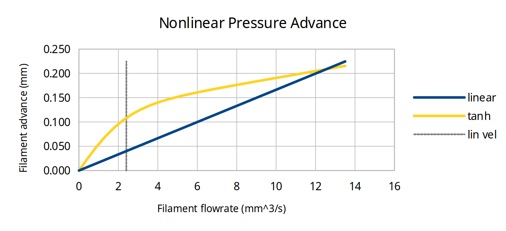
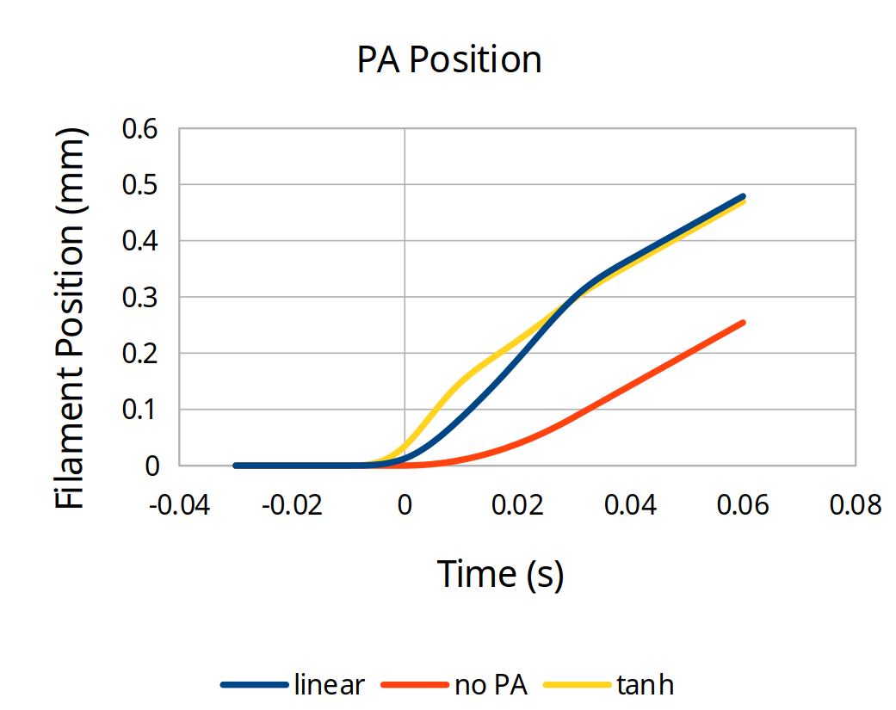
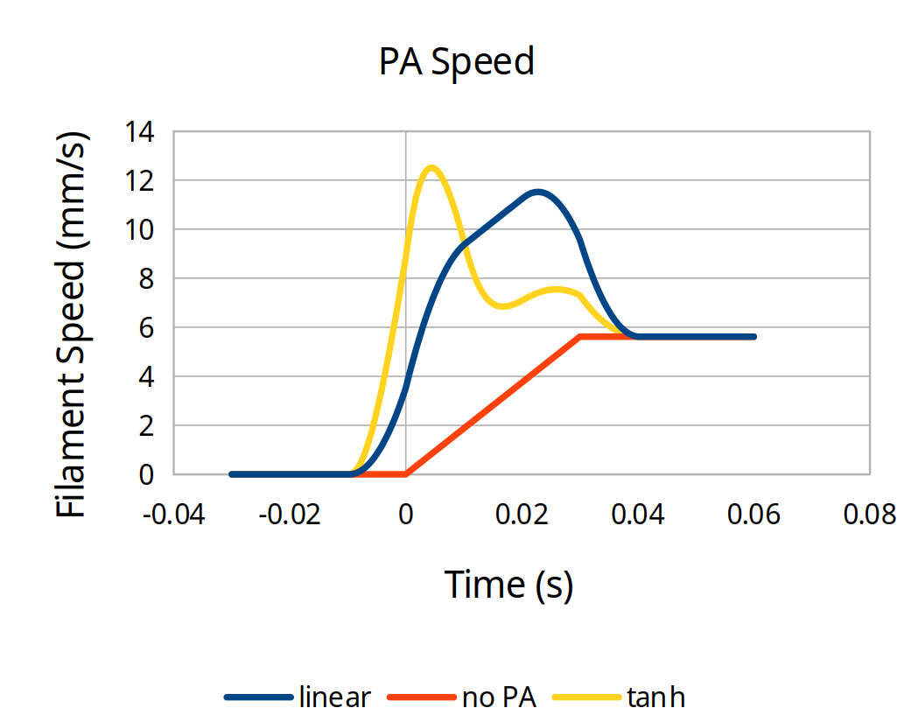
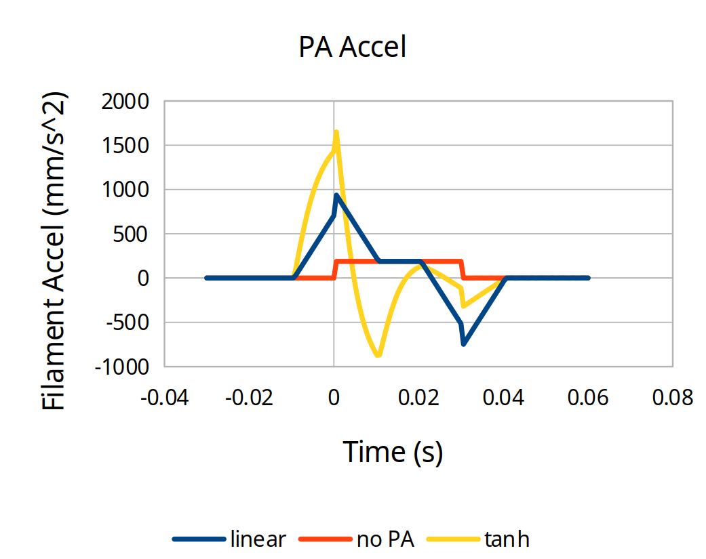
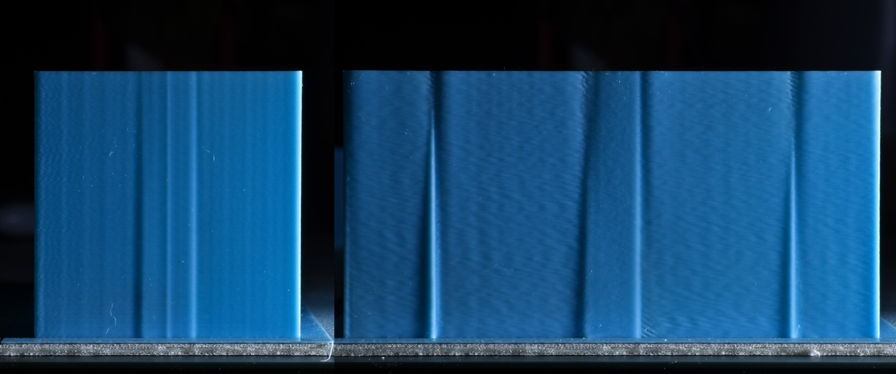
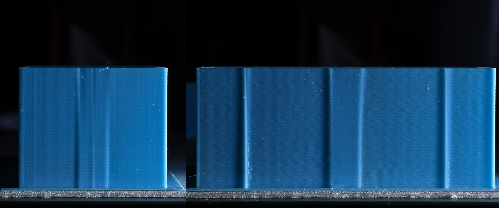
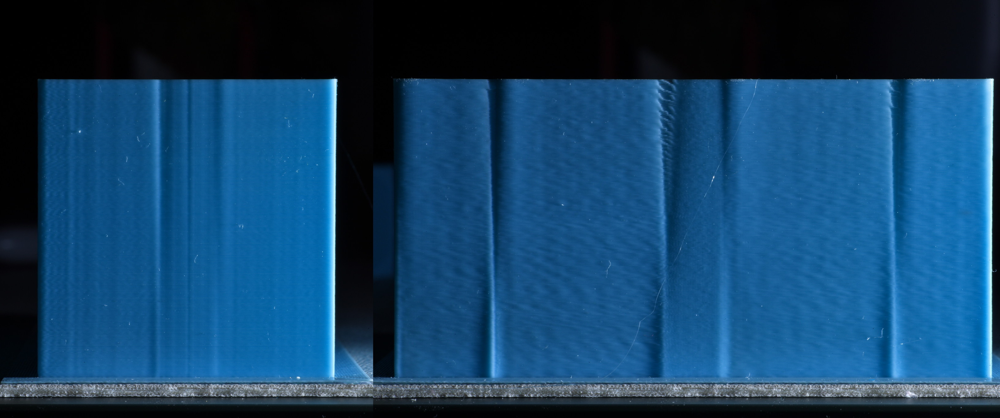
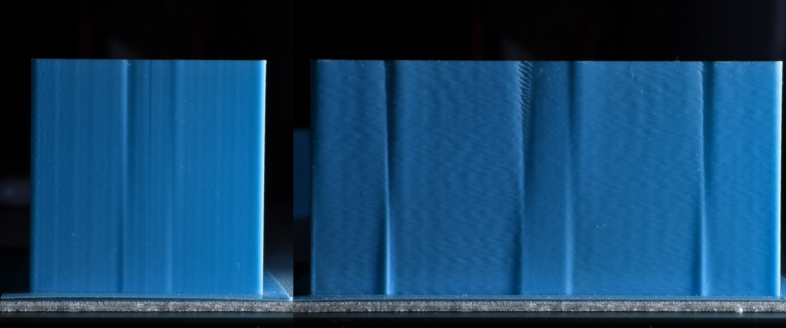
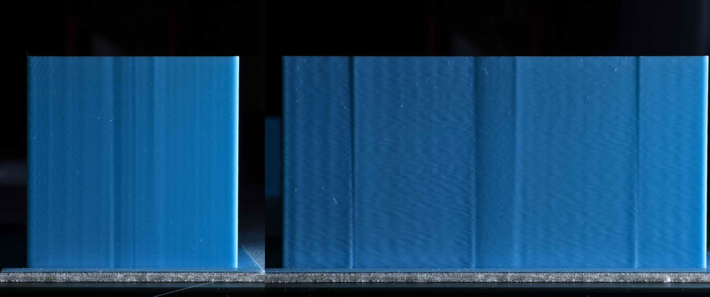

# Nonlinear Pressure Advance

This document provides information for tuning the nonlinear pressure advance found in the `bleeding_edge_v2` branch of Kalico, as well as some other related firmwares.

If you're using nonlinear pressure advance, this supersedes the standard [Pressure Advance documentation page](Pressure_Advance.md).

## Pressure Advance Overview

If a 3D printer pushes the filament at a speed perfectly proportional to the speed of the toolhead, the actual rate of plastic coming out of the nozzle will not match.

When the extruder begins to move, the flow resistance in the hotend will cause the filament under compression to buckle if it can (especially in Bowden tubes), then be linearly shortened.

To compensate for this, "pressure advance" was used that models the compressed filament and melted plastic in the hotend as a linear spring, increasing the requested extruder position ahead of the nominal position, to an amount proportional to the nominal extrusion speed.

## Problems with Linear Pressure Advance

However, there are several factors that make this model imperfect.

Firstly, the mechanical system inherently has a slight delay.
It takes time for the motion of filament at the extruder to make its way to the nozzle tip.
This means that as the toolhead speed changes, particularly at high accelerations, there can be dramatic desynchronization between the point of minimum extrusion and the actual corner where minimum toolhead speed occurs.
This manifests as thickening before corners and thinning after them.
It additionally results in different behavior at different accelerations.

Secondly, the filament under compression, structure under tension, and the melt pool do not behave elastically.
The buckling action of the filament is relatively low stiffness but once all the room in the tube is taken up then it stops being compliant any further.
The action of melting itself also is nonlinear.
As filament has to expand to make contact with the walls of the heat block, the pressure and thus flowrate affect the proportion of melted and unmelted filament in the hotend, which affects the spring constant.

This means that pressure advance that is correct for one speed and acceleration is not going to behave optimally at all speeds and accelerations.
Quite often, PA that is high enough for higher speed corners will be insufficient at lower speeds, such as seams and transitions near slower overhangs.

These effects are multiplied for printers that need higher PA such as Bowden printers.

## Explanation

Nonlinear pressure advance, instead of advancing proportionally to speed, allows the use of a nonlinear function to determine the amount the requested extrusion is ahead of the nominal amount of extrusion.

In order to provide higher effective PA at lower speeds, the amount of advance can be configured to rapidly rise at a low speed, and then level off to a lower slope for the remainder of the speed range.



In this example, the same amount of total advance occurs once the toolhead reaches its full speed, but the nonlinear advance rises more quickly at the beginning of each motion.



The rise at low speed is controlled by two parameters in the firmware: `nonlinear_offset` and `linearization_velocity`.
The linear slope that occurs past the linearization velocity is controlled by `linear_advance`.

To be perfectly clear, due to the implementation, they are not perfectly independent.
The advance at low speed is affected slightly by the `linear_advance` setting, and likewise the advance at high speed is affected by the offset and linearization velocity.

This interaction means that the different parameters need to be tuned in an iterative process, unlike standard PA with only one variable to tweak.

You can play with this in [this spreadsheet](resources/NonlinearPA_Kalico.ods).

In addition to being able to generate the two graphs above, there are also graphs providing the expected filament feedrate and acceleration.
This can be useful when tuning high speed machines to know what the limits of your extruder are.




Depending on the specific settings, nonlinear PA can request higher speeds and almost always requests higher accelerations than standard PA, so you can use this in combination with testing to ensure new settings combinations you are trying don't have issues.

Note that there are two different nonlinear functions: reciprocal and tanh.
They both can have similar results, but reciprocal provides better independence between low and high speed PA so we recommend you use that for ease of tuning.

## Setup

The best way to tune nonlinear pressure advance is to use the tuning macro that is built into `bleeding-edge-v2` Kalico.

This generates gcode to print a tuning tower that tests several different speed transitions while changing one parameter.
Because you are tuning multiple parameters, you need this to see whether your parameters are working across the board or whether you need to adjust the fixed parameters.

It is suggested to put the macros and the tuning tower configuration parameters in their own `testing_macros.cfg` file.

Set up the `[pa_test]` section according to your machine's parameters.
Generally leave size and height alone.
Put the origin where you'd like the center of the tower to be.

Set the medium and fast velocities somewhere near where you want.
For a 300mm/s printer, have `fast_velocity` be 300 and `medium_velocity` be 100.
It is best to leave the slow velocity at 20 to better probe the speeds near overhangs and seams.

Inside the `[delayed_gcode start_pa_test]` section, put in your start gcode (whether a single `print_start` macro or a sequence of individual gcode calls).

If you need more range on the tuning tower, adjust the `FACTOR` for the appropriate parameter.

```
[pa_test]
size_x: 100   # X dimension tower size  (mm)
size_y: 50    # Y dimension tower size  (mm)
height: 50    # Height of tower (mm)
origin_x: 100 # Center of the bed in X
origin_y: 100 # Center of the bed in Y
layer_height: 0.2 # mm
first_layer_height: 0.24 # mm
perimeters: 2 # Number of perimeters to be printed for the tower
brim_width: 6 # Width of brim (mm)
slow_velocity:   20 # Slowest velocity for PA test segment (mm/s)
medium_velocity: 50 # Medium velocity for PA test segment (mm/s)
fast_velocity:  150 # End velocity for PA test segment (mm/s)
filament_diameter: 1.75

[delayed_gcode start_pa_test]
gcode:
    
    ; PUT YOUR START GCODE HERE========================================================
    
    
        M221 S{flow_percent}
    
    
    
    ; If pa_value is 0 then we test the full pa range starting from 0
    
        
            TUNING_TOWER COMMAND=SET_PRESSURE_ADVANCE PARAMETER=ADVANCE START=0 FACTOR=.001 ; .01 for bowden
        
            TUNING_TOWER COMMAND=SET_PRESSURE_ADVANCE PARAMETER=OFFSET START=0 FACTOR=.01 ; .02 for bowden
        
            TUNING_TOWER COMMAND=SET_PRESSURE_ADVANCE PARAMETER=TIME_OFFSET START=0 FACTOR=.0001
        
    
        ; make sure that delta and start can not be lower then 0
        
            
            
        
            ; calculate the pa range that we want to test
            
            ; calculate the pa start value
            
        
        
            TUNING_TOWER COMMAND=SET_PRESSURE_ADVANCE PARAMETER=ADVANCE START={start} FACTOR={delta / height}
        
            TUNING_TOWER COMMAND=SET_PRESSURE_ADVANCE PARAMETER=OFFSET START={start} FACTOR={delta / height}
        
            TUNING_TOWER COMMAND=SET_PRESSURE_ADVANCE PARAMETER=TIME_OFFSET START={start} FACTOR={delta / height}
        
    
    ; PRINT_PA_TOWER must be the last command in the start_pa_test script:
    ; it starts a print and then immediately returns without waiting for the print to finish
    PRINT_PA_TOWER {vars.rawparams} FINAL_GCODE_ID=end_pa_test

[delayed_gcode end_pa_test]
gcode:
    END_PRINT
    RESTORE_GCODE_STATE NAME=PA_TEST_STATE

[gcode_macro RUN_PA_TEST]
variable_bed_temp: -1
variable_hotend_temp: -1
variable_pa_value: 0             # Used for further tuning of pa value. If value is not 0 than the tested pa value will only be +/- (determined by the pa_range variable) around of the pa_value variable
variable_pa_range: 0.03          # Only use if pa_value is set to heigher than 0. Used to set the +/- area around pa_value that should be tested
variable_flow_rate: -1
variable_testparam: 0            # 0 = advance, 1 = offset, 2 = time_offset
variable_rawparams: ''
gcode:
    # Fail early if the required parameters are not provided
    
    {action_raise_error('NOZZLE= parameter must be provided')}
    
    
    {action_raise_error('TARGET_TEMP= parameter must be provided')}
    
    SET_GCODE_VARIABLE MACRO=RUN_PA_TEST VARIABLE=bed_temp VALUE={params.BED_TEMP|default(60)}
    SET_GCODE_VARIABLE MACRO=RUN_PA_TEST VARIABLE=hotend_temp VALUE={params.TARGET_TEMP}
    SET_GCODE_VARIABLE MACRO=RUN_PA_TEST VARIABLE=pa_value VALUE={params.PA_VALUE|default(0)}
    SET_GCODE_VARIABLE MACRO=RUN_PA_TEST VARIABLE=pa_range VALUE={params.PA_RANGE|default(0.01)}
    SET_GCODE_VARIABLE MACRO=RUN_PA_TEST VARIABLE=flow_rate VALUE={params.FLOW_RATE|default(-1)}
    SET_GCODE_VARIABLE MACRO=RUN_PA_TEST VARIABLE=testparam VALUE={params.TESTPARAM|default(0)}
    SET_GCODE_VARIABLE MACRO=RUN_PA_TEST VARIABLE=rawparams VALUE="'{rawparams}'"
    SAVE_GCODE_STATE NAME=PA_TEST_STATE
    UPDATE_DELAYED_GCODE ID=start_pa_test DURATION=0.01
```

***CRITICAL NOTE***

The PA test macro will run at the acceleration specified in your `[printer]` section of `printer.cfg`.
Set that to the highest acceleration you expect to use while extruding (for infill, for example).

### Setting values via G-Code

To change the nonlinear PA at runtime, whether in the printer command line or in your slicer filament settings, use the `SET_PRESSURE_ADVANCE` command with the following arguments:

* `ADVANCE=` linear_advance
* `OFFSET=` nonlinear_offset
* `VELOCITY=` linearization_velocity
* `TIME_OFFSET=` pressure_advance_time_offset

## Tuning procedure

The tuning procedure will be slightly different for more pedestrian printers, which are dominated by offset, compared with ultra fast printers, which will have more of a linear advance component, or bowden tube printers, which have a large value for both.

When evaluating the tuning towers produced by the PA test macro, it's helpful to use a bright light to illuminate from the extreme left or right sides.

### Direct Drive, low to medium performance

1. Install Kalico and make sure to use the `bleeding-edge-v2` branch.
2. Set up the PA test macro as described in the Setup section, and make sure to set the desired acceleration in `[printer]`.
3. Set up input shaping if you plan to use it at all. It affects the readability of the tuning tower. Set up extruder sync with `enabled_extruders: extruder`.
4. In your printer configuration, set your `pressure_advance_model` to `tanh`, `linear_advance` to 0, `nonlinear_offset` to 0, `linearization_velocity` to 1, and `pressure_advance_smooth_time` to 0.02. restart the printer to load the new settings.
5. Run the pa test macro with `NOZZLE` set to your nozzle diameter, `TARGET_TEMP` set to your intended hotend temperature, and a `TESTPARAM` of 1 to vary the `nonlinear_offset`.
6. Evaluate the tower, looking primarily at the left side. Set `nonlinear_offset` in your printer config based on the height that looks best there (and the `factor` from the test macro code), and restart.
7. Run the PA test macro with your nozzle diameter, your intended hotend temperature, and a `TESTPARAM` of 0 to vary the `linear_advance`.
8. Evaluate the tower, looking mostly at both the left and front sides, and binary search to find the optimal offset and advance.
    1. If the left side converges below the front side, then slightly decrease (start with 10% and reduce if you overshoot) the `nonlinear_offset` in your config, restart, and reprint the PA test macro with `TESTPARAM` 0.
    2. If the left side converges above the front side, then slightly increase (start with 10% and reduce if you overshoot) the `nonlinear_offset` in your config, restart, and reprint the PA test macro with `TESTPARAM` 0.
    3. If the left side converges at the same height as the front side, then use that height and the `factor` from the test macro code to set the `linear_advance` in your printer config, then restart.
9. Run the PA test macro with your nozzle diameter, your intended hotend temperature, and a `TESTPARAM` of 2 to vary the `pressure_advance_time_offset`.
10. Evaluate the tower, looking mostly at the front side. This can be *very* subtle so make sure you use good lighting to reveal the differences. Set the `pressure_advance_time_offset` in your configuration based on the height that looks best there and the `factor` from the test macro code, and restart.

### Bowden or ultra high speed direct drive printers

Make sure to adjust the factors in the PA test macro for Bowden printers.

1. Install Kalico and make sure to use the `bleeding-edge-v2` branch.
2. Set up the PA test macro as described in the Setup section, and make sure to set the desired acceleration in `[printer]`.
3. Set up input shaping if you plan to use it at all. It affects the readability of the tuning tower. Set up extruder sync with `enabled_extruders: extruder`.
4. In your printer configuration, set your `pressure_advance_model` to `tanh`, `linear_advance` to 0, `nonlinear_offset` to 0, `linearization_velocity` to 1 (2 or potentially 3 for Bowden, where high acceleration plus large PA values may cause the extruder acceleration demands to be too high with low linearization velocity), and `pressure_advance_smooth_time` to 0.02. Restart the printer to load the new settings.
5. Run the PA test macro with `NOZZLE` set to your nozzle diameter, `TARGET_TEMP` set to your intended hotend temperature, and a `TESTPARAM` of 0 to vary the `linear_advance`.
6. Evaluate the tower, looking primarily at the front side. Evaluate the ideal `linear_advance` based on the height that looks best there and the `factor` from the test macro code, write down that value, but set the configuration to at 80% of that, and restart.
7. Run the PA test macro with your nozzle diameter, your intended hotend temperature, and a `TESTPARAM` of 1 to vary the `nonlinear_offset`.
8. Evaluate the tower, looking mostly at both the left and front sides, and binary search to find the optimal offset and advance.
    1. If the left side converges below the front side, then slightly increase (start with 10% and reduce if you overshoot) the `linear_advance` in your config, restart, and reprint the PA test macro with `TESTPARAM` 1.
    2. If the left side converges above the front side, then slightly decrease (start with 10% and reduce if you overshoot) the `linear_advance` in your config, restart, and reprint the PA test macro with `TESTPARAM` 1.
    3. If the left side converges at the same height as the front side, then use that height and the `factor` from the test macro code to set the `nonlinear_offset` in your printer config, then restart.
9. Run the PA test macro with your nozzle diameter, your intended hotend temperature, and a `TESTPARAM` of 2 to vary the `pressure_advance_time_offset`.
10. Evaluate the tower, looking mostly at the front side. This can be *very* subtle so make sure you use good lighting to reveal the differences. Set the `pressure_advance_time_offset` in your configuration based on the height that looks best there and the `factor` from the test macro code, and restart.
11. Run the PA test macro again with `TESTPARAM` of 1 and fine-tune your settings using the procedure in step 8 again.

### SV06 Plus example

This is an example of tuning nonlinear PA on a Sovol SV06 Plus (featuring a standard volcano length hotend with a slightly longer nozzle tip) at 150mm/s and 5k acceleration using standard PLA at 215 C.

First a PA test tower was with the test parameter 0 and set `linear_advance` based on the front speed transitions.
In this case `linear_advance` was 0.04.



Next, a ringing test tower was printed in order to set shapers, as a bed accelerometer was not available. Extruder sync was enabled.
Another ringing test tower was printed to check that ringing was suppressed.

`linear_advance` was set back to zero, `linearization_velocity` to 1, `pressure_advance_smooth_time` to 0.02, and `pressure_advance_time_offset` to 0.
Then a PA test tower was printed with the test parameter 1.



In this case, the left side looked best at roughly 27mm \* 0.005, so the `nonlinear_offset` was set to 0.135 to start with and a PA test tower was printed with test parameter 0.


In this test the left side converged at the very bottom but the right side converged above that, so `nonlinear_offset` was decreased a bit to 0.120.
In hindsight, looking at the previous test tower for `nonlinear_offset`, the left line on the left side just barely started to have a "thick-and-thin" pattern at 24mm, and the right line was only slightly undercorrected.
In general, it's better to undercorrect slightly on your initial `nonlinear_offset`, since the `linear_advance` will give a little boost even at slow speeds.

With the `nonlinear_offset` reduce to 0.120, another test tower with test parameter 0 was printed.



This shows good convergence for both left and front sides at 17mm \* 0.001, so the ideal `linear_advance` was 0.017, and there was no need to tweak `nonlinear_offset` any further.

Just as a demonstration, here is what a slight overcorrection of `nonlinear_offset` to 0.100 looks like when printing a test tower with test parameter 0:



It's not quite so clear-cut, but the left side converges somewhat higher than the front side of the test tower. If you saw this you would nudge up the `nonlinear_offset` and retest.

Finally the time offset was tuned to properly align the pressure advance compensation with the actual toolhead motion.

The last tuning tower was printed with the printer set to 0.120 linear offset, 0.017 linear advance, and with the macro's test parameter set to 2.



This is a lot harder to see the effects from, but extreme sidelighting shows that the leftmost and rightmost transitions on the front face benefit from a height of 18mm \* 0.0001, indicating that the `pressure_advance_time_offset` should be set to 0.0018. This means that the pressure advance should occur 1.8 milliseconds early in order to best synchronize flow with the toolhead motion.

### Performance Comparison

This is a comparison of Voron test cubes printed with three different linear PA (no time offset) versus the nonlinear tuning.

The perimeters were printed at a modest 3000 mm/s^2 acceleration for maximum quality, but even so the differences are visible.
At higher accelerations the differences will be more visible.

Additionally, this comparison does not compare with main branch or vanilla Klipper, which do not have the extruder synced to the input shaping.


From left to right the columns are: sidelit bottom, sidelit Y, toplit Y, sidelit X, toplit X, and the top of the cube frontlit.

On the bottom, the 0.025 linear PA has a noticeable bulge at the ESE corner, while the others show little differences.

On the sidelit Y face you can see that all three linear PAs have dark outlines around the sides and top faces of the hexagon where there are slight lowered areas.
They also all bulge out noticeably near the overhang corner where the linear PA is undercompensating at the low speeds of the overhang printing.
By comparison, the face of the nonlinear PA is extrememly flat.

Viewed with top lighting, it's easy to see how much less of a bulge there is on top faces of the hexagon from the nonlinear PA.

The sidelit X face shows a much flatter surface around the slots in the nonlinear test cube, while the linear test cubes show shadowed areas to the right of the slots.

When toplit, the 0.4 and 0.3 linear PA show a large bulge slightly late after each slot that casts a shadow below.
The 0.25 linear PA shows a small indentation after the top of each slot possibly from the transition from a very slow bridge speed to wall speed.
Nonlinear PA exhibits similar effects but to a much smaller extent.

The top view illustrates that 0.30 is already too much linear PA to maintain full extrusion around corners.
0.40 linear has large gaps between the perimeter lines, and it's starting to have voids at the ends of solid infill lines.
Both nonlinear and 0.25 linear fully extrude around corners.
